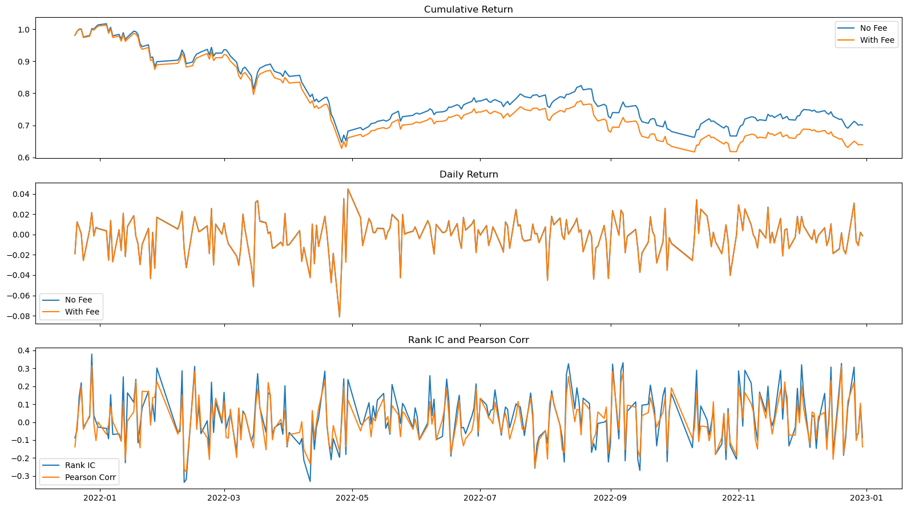

# 简易量化交易系统实现

<center><div style='height:2mm;'></div><div style="font-family:华文楷体;font-size:14pt;">当代量化交易系统的原理和实现 中期报告</div></center>
<center><span style="font-family:华文楷体;font-size:9pt;line-height:9mm">作者：李宗远 &nbsp;&nbsp;&nbsp;&nbsp;指导老师：姜昌浩</span>
</center>

## 项目介绍

### 目录结构

```plaintext
.
├── factor.py - **因子构造和管理平台（前端）**
├── modules
│   ├── backtest  - **信号回测引擎**
│   │   ├── backtrader.py
│   │   └── strategy.py - 策略组件
│   ├── config.py - 配置文件
│   ├── factor_benchmark - **因子测评平台**
│   │   └── utils.py
│   ├── factor_composition - **因子组合平台**
│   │   ├── regressor.py - 模型组件
│   │   ├── selector.py - 筛选器组件
│   │   └── utils.py
│   ├── factor_construction - **因子构造和管理平台（后端）**
│   │   ├── compute_engine.py - 计算引擎
│   │   └── data_engine.py - 数据引擎
│   ├── \_\_init\_\_.py
│   ├── utils.py - 一些工具
│   └── visualization.py - **可视化引擎**
├── newdata - 新生成的文件
│   ├── factors.joblib
│   └── returns.joblib
├── README.md - 说明文档
├── sample_factor_exploration.ipynb - 因子回测样例
└── sample_model_exploration.ipynb - 因子组合样例
```

### 完成度

由于时间有限，相比于中期报告中的设计，在完成系统的过程中我对做了一些简化。

**因子构造和管理平台**

- 因子的计算流程使用了比较粗糙的 API 完成；
- 因子的计算状态和入库状态暂时不进行管理。

**因子测评平台**

因子对比部分暂时没有多处理，目前仅仅展示了因子的相关系数。

## 组件使用介绍

### 因子构造和管理平台

#### 构造因子

构造因子时，在 factor.py 文件中构造类似如下的函数即可：

```python
def factor_past_return(data_engine: DataEngine, compute_engine: ComputeEngine,
                       factors: Dict[str, xr.DataArray]) -> None:
    for i in [1, 2, 3, 5, 10, 15]:
        factors["PAST_RETURN_" + str(i)] = compute_engine.shift(
            compute_engine.ret(data_engine.close_adj, data_engine.date_col, i),
            data_engine.date_col, 1)
    return factors
```

最后，在 compute_factor 函数中，将你构造的因子加入构造过程即可。

```python
def compute_factor(data_engine: DataEngine,
                   compute_engine: ComputeEngine) -> None:
    ...

    # Compute the factors for different time periods
    factors = factor_past_return(data_engine, compute_engine, factors)
    ...

    ...
```

#### 计算因子

构造完成后，在 bash 中运行

```bash
python factor.py
```

即可更新因子库。

#### 更改收益率定义

回测用的收益率定义为当天收盘价买入，第二天收盘价卖出。你可以根据需要修改这个定义。

```python
def compute_factor(data_engine: DataEngine,
                   compute_engine: ComputeEngine) -> None:
    ...
    # Compute the returns using the compute_engine.ret() method
    returns = compute_engine.ret(data_engine.close_adj, data_engine.date_col, 1)
    ...
```

### 因子测评平台/因子组合平台

请参考提供的 sample\_factor\_exploration.ipynb 以及 sample\_model\_exploration.ipynb，两个文件中详细介绍了 api 的使用并提供了使用案例。

## 基础要求的实现

### 利用 API 实现 N 日反转策略

参考 sample_factor_exploration.ipynb，文件中展示了 10 日反转因子的回测结果。

**因子构建**

构建银子时，请仿照案例构建 PAST\_RETURN\_N 因子。

**因子选取**

选取因子时，取因子的相反数。因为我们要做多跌的最狠的股票。

### 回测结果汇报

|                             | 平均 Pearson 相关系数 | 平均 Spearman 秩相关系数 |
| :-------------------------: | :-------------------: | :----------------------: |
| 统计量 (test samples = 252) |        0.01105        |         0.029014         |

| test samples = 252 | 年化收益率 | 年化波动率 | 年化夏普比率 | 测试期年化超额收益 | 测试期最大回撤 |
| :----------------: | :--------: | :--------: | :----------: | :----------------: | :------------: |
|      无手续费      | -0.355026  |  0.277244  |  -1.280551   |     -0.151184      |   -0.453412    |
|      有手续费      | -0.447753  |  0.277274  |  -1.614843   |     -0.243911      |   -0.496314    |

### 回测净值曲线



